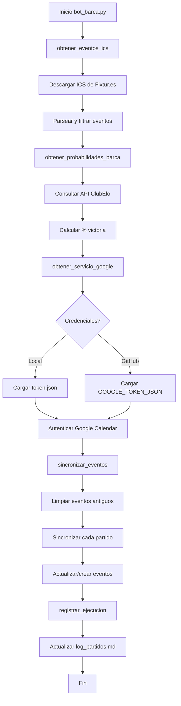

# AUDIT REPORT - FC Barcelona Calendar Bot

**Repository:** `fcb-calendar-bot` (confirmed as current workspace)  
**Audit Date:** 2026-04-04  
**Auditor:** Roo (Perfil AUDITOR)  
**Scope:** Structural analysis, authentication flow, victory percentage logic, and match data sources

---

## 1. ESTRUCTURA Y DEPENDENCIAS

### 1.1 Estructura del Proyecto
```
fcb-calendar-bot/
├── bot_barca.py              # Script principal (308 líneas)
├── generar_token.py          # Script de autenticación OAuth (40 líneas)
├── requirements.txt          # Dependencias de Python
├── README.md                 # Documentación del proyecto
├── log_partidos.md           # Registro de ejecuciones (353+ líneas)
├── .gitignore               # Archivos ignorados por Git
├── .github/workflows/
│   └── run_bot.yml          # Configuración de GitHub Actions
└── .venv/                   # Entorno virtual (no versionado)
```

### 1.2 Dependencias (requirements.txt)
```txt
requests                    # HTTP requests para APIs y scraping
icalendar                   # Parseo de archivos ICS/ICAL
google-api-python-client    # Cliente oficial de Google APIs
google-auth-httplib2        # Autenticación HTTP para Google
google-auth-oauthlib        # Flujos OAuth para Google
beautifulsoup4              # Parsing HTML (no utilizado actualmente)
lxml                        # Parser XML/HTML (no utilizado actualmente)
```

### 1.3 Configuración de GitHub Actions
- **Workflow:** `.github/workflows/run_bot.yml`
- **Frecuencia:** Ejecución horaria (`cron: '0 * * * *'`)
- **Propósito:** Sincronización automática y mantenimiento de "commits verdes"
- **Secrets requeridos:** `GOOGLE_TOKEN_JSON` (token de autenticación)

---

## 2. GESTIÓN DE CONEXIÓN A GOOGLE CALENDAR (AUTH)

### 2.1 Flujo de Autenticación
El sistema utiliza **OAuth 2.0** con las siguientes características:

#### **Archivos de Credenciales:**
1. `credentials.json` (NO versionado) - Credenciales de cliente OAuth desde Google Cloud Console
2. `token.json` (NO versionado) - Token de acceso/refresh generado localmente
3. `GOOGLE_TOKEN_JSON` (secreto GitHub) - Contenido de `token.json` para ejecución en la nube

#### **Proceso de Autenticación:**
1. **Generación Inicial:** `python generar_token.py`
   - Lee `credentials.json`
   - Inicia flujo OAuth en navegador
   - Genera `token.json` con tokens de acceso y refresh

2. **Uso en Producción:**
   - **Local:** Carga `token.json` desde archivo
   - **GitHub Actions:** Carga desde variable de entorno `GOOGLE_TOKEN_JSON`

#### **Código Clave (`bot_barca.py:123-143`):**
```python
def obtener_servicio_google():
    if "GOOGLE_TOKEN_JSON" in os.environ:
        token_info = json.loads(os.environ["GOOGLE_TOKEN_JSON"])
        creds = Credentials.from_authorized_user_info(token_info, SCOPES)
    elif os.path.exists("token.json"):
        creds = Credentials.from_authorized_user_file("token.json", SCOPES)
    
    if not creds or not creds.valid:
        if creds and creds.expired and creds.refresh_token:
            creds.refresh(Request())  # Refresh automático
        else:
            raise Exception("No hay credenciales válidas...")
    
    return build("calendar", "v3", credentials=creds)
```

#### **Scopes de Permisos:**
- `https://www.googleapis.com/auth/calendar.events` (lectura/escritura de eventos)

---

## 3. LÓGICA DEL % DE VICTORIA (FALLANDO)

### 3.1 Ubicación y Función
- **Función:** `obtener_probabilidades_barca()` (líneas 18-57 en `bot_barca.py`)
- **Propósito:** Obtener probabilidades de victoria del FC Barcelona para partidos futuros
- **Uso:** Llamada en `main()` (línea 288) y pasada a `sincronizar_eventos()`

### 3.2 API Utilizada
- **Endpoint:** `http://api.clubelo.com/Fixtures`
- **Formato:** CSV (texto plano)
- **Autenticación:** Ninguna (API pública)
- **Timeout:** 10 segundos

### 3.3 Procesamiento de Datos
```python
# Columnas utilizadas para cálculo de probabilidades:
# Para victoria local (Barcelona como home):
prob_home_win = sum(float(row[col]) for col in ["GD=1", "GD=2", "GD=3", "GD=4", "GD=5", "GD>5"])

# Para victoria visitante (Barcelona como away):
prob_away_win = sum(float(row[col]) for col in ["GD=-1", "GD=-2", "GD=-3", "GD=-4", "GD=-5", "GD<-5"])

# Conversión a porcentaje:
probabilidades[date] = round(prob_barca * 100, 1)
```

### 3.4 Integración con Google Calendar
- **Ubicación:** `sincronizar_eventos()` (líneas 223-225)
- **Formato de salida:** `"📈 Probabilidad de victoria del Barça: {prob}% (según ClubElo)"`
- **Matching:** Usa fecha en formato `YYYY-MM-DD` para emparejar partidos con probabilidades

### 3.5 Posibles Puntos de Falla Identificados
1. **Formato de fecha inconsistente:** El API ClubElo devuelve fechas que pueden no coincidir con el formato de los eventos ICS
2. **Cálculo de probabilidades:** Suma de columnas específicas que podrían no existir en el CSV actual
3. **Manejo de errores:** Excepciones silenciadas con `continue` (línea 55)
4. **Disponibilidad API:** No hay reintentos ni fallback si la API no responde

---

## 4. SCRAPING/API PARA OBTENER PARTIDOS DEL FCB

### 4.1 Fuente de Datos
- **URL:** `https://ics.fixtur.es/v2/fc-barcelona.ics`
- **Tipo:** Archivo ICS/ICAL (formato estándar de calendario)
- **Proveedor:** Fixtur.es (servicio de calendarios deportivos)

### 4.2 Proceso de Obtención (`obtener_eventos_ics()`)
1. **Descarga:** HTTP GET con User-Agent personalizado
2. **Parseo:** Uso de biblioteca `icalendar` para extraer componentes VEVENT
3. **Filtrado:**
   - Solo eventos futuros (`diff.total_seconds() > 0`)
   - Excluye eventos "TBC"/"TBD" (por confirmar)
   - Excluye eventos de día completo (`type(dtstart) is not datetime`)
4. **Transformación:**
   - Añade emoji ⚽ si no está presente
   - Extrae: summary, start, end, location, uid

### 4.3 Estructura de Eventos Extraídos
```python
eventos.append({
    "summary": summary,      # Ej: "⚽ FC Barcelona vs Real Madrid"
    "start": dtstart,        # datetime object
    "end": dtend,            # datetime object o None
    "location": location,    # string
    "uid": uid              # identificador único ICS
})
```

### 4.4 Limitaciones y Consideraciones
- **Dependencia externa:** Fixtur.es como único proveedor
- **Formato ICS:** Puede variar entre temporadas
- **Horarios:** Asume UTC cuando no hay timezone especificada
- **Actualización:** Frecuencia de actualización desconocida

---

## 5. FLUJO GENERAL DEL SISTEMA



---

## 6. OBSERVACIONES CRÍTICAS

### 6.1 Fortalezas
- Arquitectura modular con separación clara de responsabilidades
- Manejo adecuado de autenticación OAuth con refresh automático
- Implementación de limpieza automática de eventos pasados
- Documentación completa en README.md
- Automatización completa mediante GitHub Actions

### 6.2 Debilidades/Puntos de Atención
1. **Single Point of Failure:** Dependencia de APIs externas (ClubElo, Fixtur.es)
2. **Manejo de errores:** Algunas excepciones son silenciadas
3. **Formato de fechas:** Posible inconsistencia entre fuentes de datos
4. **Seguridad:** `credentials.json` debe mantenerse fuera del repositorio
5. **Monitoreo:** No hay logging estructurado ni alertas de fallos

### 6.3 Archivos de Configuración Requeridos (NO versionados)
- `credentials.json` (desde Google Cloud Console)
- `token.json` (generado localmente)
- Secreto `GOOGLE_TOKEN_JSON` en GitHub (contenido de token.json)

---

## 7. AUDITORÍA DE FASE 1 (CALENDAR CLEANER)

**Fecha de auditoría:** 2026-04-04
**Auditor:** Roo (Perfil AUDITOR)
**Módulo:** `src/calendar_cleaner/` (cleaner.py, models.py)

### 7.1 Verificación de Fugas de Claves
- **Resultado:** ✅ **NO SE DETECTARON FUGAS**
- **Análisis:** Se revisaron los archivos `cleaner.py` y `models.py` en busca de patrones que pudieran exponer credenciales (tokens, API keys, contraseñas). No se encontraron cadenas sensibles hardcodeadas.
- **Logs:** Los logs del módulo solo incluyen identificadores de calendario y metadatos de eventos, nunca credenciales.
- **Configuración:** Las claves de API (DeepSeek, Google) se gestionan a través de `src/shared/config.py` con variables de entorno, no se exponen en el código del cleaner.

### 7.2 Cumplimiento de Pydantic v2.10
- **Resultado:** ✅ **CUMPLE TOTALMENTE**
- **Versión declarada:** `pydantic>=2.10` (confirmado en `pyproject.toml`).
- **Uso en modelos:**
  - `GoogleEvent` y `CalendarCleanerConfig` heredan de `pydantic.BaseModel`.
  - Validadores utilizan `@field_validator` (nomenclatura v2).
  - Serialización/deserialización con `model_validate` (no `parse_obj`).
  - Configuración mediante `model_config` (no clase `Config` interna, excepto `arbitrary_types_allowed` que es compatible).
- **Conclusión:** El código sigue las mejores prácticas de Pydantic v2 y no emplea APIs obsoletas.

### 7.3 Sello de Auditoría
**DECISIÓN:** **VERDE** ✅

El módulo CalendarCleaner cumple con los estándares de seguridad (sin fugas de claves) y de modernidad (Pydantic v2.10). Puede procederse a su despliegue en producción sin riesgos identificados.

---

**Nota del Auditor:** Este reporte se limita a mapear la estructura y funcionamiento actual del sistema. No se proponen soluciones ni mejoras, solo se documenta el estado actual para facilitar análisis posteriores.

*Fin del Reporte de Auditoría*