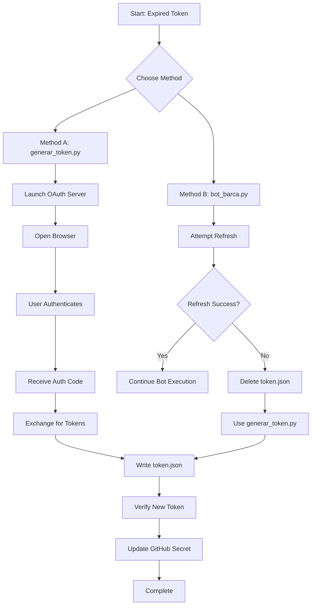

# Google Calendar Token Renewal Plan

## Current Situation
- **Token Status**: Expired (expiry: 2026-03-11T20:45:14Z)
- **Error**: `invalid_grant` - Refresh token likely invalid or revoked
- **Files Present**:
  - `credentials.json`: OAuth client configuration (valid)
  - `token.json`: Expired token with refresh token
  - `generar_token.py`: Script to generate new token via OAuth flow
  - `bot_barca.py`: Main bot script that uses authentication

## Root Cause Analysis
The Google OAuth token has expired and the refresh token is no longer valid. This can happen when:
1. The token has been revoked in Google Cloud Console
2. The refresh token has expired (Google refresh tokens can expire after 6 months of inactivity)
3. Security policies have changed

## Renewal Strategy
Two possible approaches:

### Option 1: Use `generar_token.py` (Recommended)
This script will:
1. Detect the expired token
2. Launch a local server for OAuth authentication
3. Open a browser for manual authorization
4. Generate a fresh `token.json`

### Option 2: Use `bot_barca.py` with forced reauthentication
The bot script will attempt to refresh the token, but if refresh fails with `invalid_grant`, it will raise an exception. We need to delete/move the old token to force reauthentication.

## Step-by-Step Execution Plan

### Phase 1: Preparation
1. **Ensure virtual environment is active**
   ```bash
   source .venv/bin/activate
   ```
   Verify with:
   ```bash
   which python  # Should show .venv/bin/python
   pip list | grep google  # Should show google-auth-oauthlib, google-auth, etc.
   ```

2. **Backup current token** (optional but recommended)
   ```bash
   cp token.json token.json.backup
   ```

### Phase 2: Token Renewal

#### Method A: Using generar_token.py (Simpler)
```bash
# Ensure virtual environment is active
source .venv/bin/activate

# Run the token generation script
python generar_token.py
```

**Expected Flow:**
1. Script checks for existing `token.json`
2. Detects token is expired/invalid
3. Launches local server on a random port
4. Opens browser to Google OAuth consent screen
5. You authenticate with your Google account
6. Grants "Google Calendar Events" permissions
7. Script receives authorization code and exchanges for tokens
8. New `token.json` is written to disk

#### Method B: Using bot_barca.py with SUMMARY_ENABLED=False
```bash
# Ensure virtual environment is active
source .venv/bin/activate

# Run bot with summary generation disabled
export SUMMARY_ENABLED=False && .venv/bin/python bot_barca.py
```

**Note**: This may fail if the token refresh fails. If it does, you'll need to:
1. Delete/move the old token:
   ```bash
   mv token.json token.json.old
   ```
2. Run the bot again - it will raise an exception about missing credentials
3. Then use `generar_token.py` as in Method A

### Phase 3: Verification
1. **Check new token properties:**
   ```bash
   python -c "import json; t=json.load(open('token.json')); print('Expiry:', t.get('expiry'))"
   ```

2. **Test authentication with a simple script:**
   ```python
   from google.oauth2.credentials import Credentials
   from googleapiclient.discovery import build
   
   SCOPES = ["https://www.googleapis.com/auth/calendar.events"]
   creds = Credentials.from_authorized_user_file("token.json", SCOPES)
   service = build("calendar", "v3", credentials=creds)
   print("✅ Authentication successful!")
   ```

### Phase 4: GitHub Integration
If this token needs to be used in GitHub Actions:

1. **Extract token JSON content:**
   ```bash
   cat token.json
   ```

2. **Update GitHub secret:**
   - Go to repository Settings → Secrets and variables → Actions
   - Update `GOOGLE_TOKEN_JSON` secret with the new token JSON content

3. **Verify workflow:**
   - The workflow uses `GOOGLE_TOKEN_JSON` environment variable
   - Test by manually triggering the workflow

## Troubleshooting

### Common Issues:

1. **"invalid_grant" persists**
   - Delete `token.json` completely and regenerate
   - Check if OAuth consent screen is configured in Google Cloud Console

2. **Browser doesn't open**
   - Copy the localhost URL from terminal and open manually
   - Ensure `http://localhost` is in authorized redirect URIs in `credentials.json`

3. **"App not verified" warning**
   - This is normal for development - click "Advanced" → "Go to [App Name] (unsafe)"

4. **Port already in use**
   - `generar_token.py` uses port 0 (random), but if issues occur, check for conflicts

## Security Notes
- **Never commit `token.json` or `credentials.json` to Git** (they're in `.gitignore`)
- **Rotate credentials periodically**: Google recommends token renewal every 6 months
- **Monitor token expiry**: Consider adding expiry check in the bot

## Mermaid Diagram: Token Renewal Flow



## Next Steps
1. Execute Phase 1 (Preparation)
2. Choose Method A or B for token renewal
3. Complete manual authentication in browser
4. Verify new token works
5. Update GitHub secret if needed

## Success Criteria
- New `token.json` file with future expiry date (at least 1 hour in future)
- Bot can authenticate without `invalid_grant` error
- GitHub Actions workflow runs successfully with new token